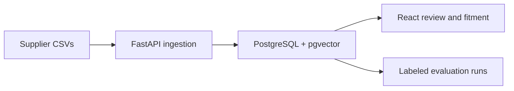

# Automotive Parts Catalogue Intelligence

A runnable portfolio demo for importing messy supplier CSVs, classifying candidate duplicate parts with versioned rules, reviewing merges, looking up **source-declared** vehicle fitment, and comparing evaluations. The React dashboard calls a FastAPI service. The Docker setup uses PostgreSQL with pgvector; a local SQLite mode is available for development.



> **Synthetic data:** All suppliers, brands, vehicles and fitments in `data/` are fictional. This is not a real parts or safety catalogue.

## Run with Docker

Install Docker Desktop, open a terminal in this repository, then run:

```bash
docker compose up --build
```

Open **http://localhost:8080**. Two catalogues, candidate pairs, 16 hand-labeled pairs, and a baseline evaluation load automatically into a new database. Data is retained in Docker volumes. `docker compose down -v` deletes the demo database and stored raw CSVs.

The Docker service enables the pgvector extension and stores 64-dimensional hashed text vectors. The `Nearest records` panel reads them through a cosine-distance query. Duplicate decisions use the explainable TF-IDF and rule score below, rather than silently accepting vector neighbors.

## Run locally in VS Code (macOS/Linux)

Use **Terminal → New Terminal**, then run these from the project root:

```bash
cd backend
python3 -m venv .venv
source .venv/bin/activate
pip install -r requirements-dev.txt
uvicorn app.main:app --reload
```

Open a **second terminal** in the project root:

```bash
cd web
npm ci
npm run dev
```

Open **http://localhost:5173**. The local backend stores its SQLite database and raw CSV files in `backend/`. API documentation is at **http://localhost:8000/docs**. Use Python 3.12+ and Node 24+.

## What you can do

1. Inspect the seeded supplier catalogues and normalized part groups.
2. In **Match review**, compare supplier records and confirm or reject a proposed duplicate. A confirmed merge groups source rows under one canonical ID; it never creates new vehicle declarations.
3. In **Fitment lookup**, search a fictional vehicle such as `Aster / A1 / 2020 / 1.6L`. Results are backed by specific source rows and year ranges. If a source omits engine information, the result says `engine unverified`.
4. In **Evaluations**, select a matching rule version and threshold, compare precision/recall/F1 and ranking quality, inspect false positives and false negatives, and view recent API latency and failure rates. The classification metrics are for the 16 curated pairs only, not a production estimate.
5. In **Catalogues**, import another UTF-8 CSV. Valid rows load, invalid rows return line numbers, and new cross-supplier candidate pairs enter the review queue. Exact duplicate uploads are rejected by SHA-256 digest.

### CSV format

See `data/supplier_north.csv`. Required headers:

```text
supplier,sku,brand,part_number,description,category,make,model,year_start,year_end
```

Optional header: `engine`. There is a 2 MB / 500-row limit per file and 1,500 source rows total. Supplier plus SKU must be unique. The original file is stored by content hash. The source records and every manual merge remain in the database.

### Matching and metrics

- Normalize brand names, descriptions, and part numbers; compare only cross-supplier records in the same brand and category.
- Use scikit-learn character TF-IDF cosine similarity for descriptions. Exact normalized part number, description similarity, and overlapping **declared** fitment contribute to a transparent score. A threshold classifies each pair as a suggested match or nonmatch. Candidate floor: `0.55`. No candidate merges automatically.
- `rules-tfidf-v1` drives the review queue. `rules-tfidf-v2` is an evaluation variant that penalizes conflicting vehicle and engine declarations; selecting it for an experiment does not change the review queue. Both versions are deterministic rules, not supervised models trained on the tiny labeled set.
- A deliberate hard negative reuses part number `F100` for another fictional vehicle. It illustrates why even an exact number needs source review.
- `data/gold_pairs.csv` is a curated labeled set. Each run scores those exact pairs at its chosen threshold; the ranking measures positive queries against all other suppliers' candidates. The dataset fingerprint combines the uploaded CSV hashes with the labeled pairs, so a new import creates a new version. Each run retains its dataset and model version. Compare accuracy only on runs with the same dataset version. This demo does **not** train a supervised classifier, infer fitment from text, or claim real-world accuracy.
- Evaluation latency is total batch scoring time divided by labeled pairs; its failure rate counts scoring errors in that run. Separately, the API monitoring panel reports average and p95 request latency plus HTTP 5xx and 4xx rates from the most recent 100 requests. Health and monitoring requests are excluded; query strings are never stored. The database retains roughly the latest 2,000 request metrics.
- In SQLite mode, the similar-parts endpoint uses the same 64-dimensional scikit-learn hashing vectors in memory; PostgreSQL mode stores and searches them with pgvector.

## Optional Azure integrations

Copy `.env.example` to `.env` and set credentials if you have them. Docker Compose reads `.env`; for local development, export the variables before starting the API.

- **Azure Blob Storage:** Set `AZURE_STORAGE_CONNECTION_STRING` and optionally `AZURE_STORAGE_CONTAINER`. Create that container before uploading. Originals are stored by digest in the container; without configuration, originals remain local.
- **Azure OpenAI:** Set endpoint, key, deployment, and API version. A JSON-output-capable chat deployment enables an **Ask AI** button on a proposed duplicate. The response is advisory text only. It never merges records or creates fitment. This sends the two selected supplier records to your Azure deployment only when you click the button.

The repository contains no credentials. Do not expose the API publicly as-is: it has no authentication, tenant isolation, background job queue, or production data licensing workflow.

## Test and build

```bash
cd backend && python -m pytest -q
cd ../web && npm run build
```

CI runs both commands on pushes and pull requests. The test suite covers seed data, versioned evaluations, dataset changes after upload, API monitoring, upload validation, source-backed fitment, vector neighbor lookup, and review decisions.

## API examples

```bash
curl http://localhost:8000/api/overview
curl http://localhost:8000/api/datasets
curl http://localhost:8000/api/models
curl http://localhost:8000/api/monitoring
curl 'http://localhost:8000/api/fitment?make=Aster&model=A1&year=2020&engine=1.6L'
curl -F 'file=@data/supplier_north.csv' http://localhost:8000/api/catalogues
```

The third example rejects an exact duplicate if you are using the seeded database. Use a new CSV to exercise uploads. Browse `/docs` for the full API contract.
